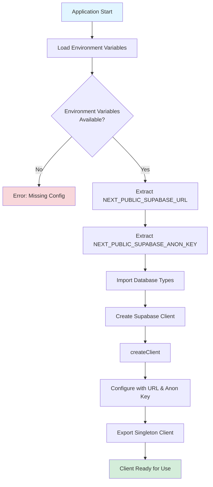
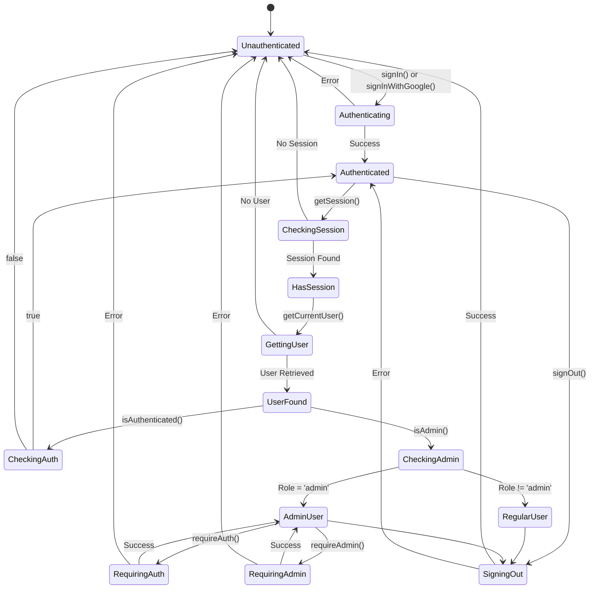

# Supabase SDK Flows

## SDK Initialization Flow

```mermaid
flowchart TD
    A[Application Start] --> B[Load Environment Variables]
    B --> C{Environment Variables<br/>Available?}
    C -->|No| D[Error: Missing Config]
    C -->|Yes| E[Extract NEXT_PUBLIC_SUPABASE_URL]
    E --> F[Extract NEXT_PUBLIC_SUPABASE_ANON_KEY]
    F --> G[Import Database Types]
    G --> H[Create Supabase Client]
    H --> I[createClient<Database>]
    I --> J[Configure with URL & Anon Key]
    J --> K[Export Singleton Client]
    K --> L[Client Ready for Use]
    
    style A fill:#e1f5ff
    style L fill:#d4edda
    style D fill:#f8d7da
```

## Authentication Flow

```mermaid
flowchart TD
    Start[User Initiates Auth] --> AuthMethod{Choose Auth Method}
    
    AuthMethod -->|Email/Password| EmailAuth[signIn Function]
    AuthMethod -->|Google OAuth| GoogleAuth[signInWithGoogle Function]
    
    EmailAuth --> EmailCall[supabase.auth.signInWithPassword]
    EmailCall --> EmailResult{Success?}
    EmailResult -->|Error| EmailError[Throw Error]
    EmailResult -->|Success| EmailSuccess[Return Auth Data]
    
    GoogleAuth --> GetRedirect[Get Redirect URL]
    GetRedirect --> GoogleCall[supabase.auth.signInWithOAuth]
    GoogleCall --> GoogleConfig["Provider: google<br/>RedirectTo: /admin"]
    GoogleConfig --> GoogleResult{Success?}
    GoogleResult -->|Error| GoogleError[Throw Error]
    GoogleResult -->|Success| GoogleRedirect[Redirect to Google]
    GoogleRedirect --> GoogleCallback[OAuth Callback]
    GoogleCallback --> GoogleSuccess[Return Auth Data]
    
    EmailSuccess --> SessionCheck[Check Session]
    GoogleSuccess --> SessionCheck
    SessionCheck --> GetSession[getSession Function]
    GetSession --> SessionCall[supabase.auth.getSession]
    SessionCall --> SessionResult{Session Exists?}
    SessionResult -->|No| NoSession[Return null]
    SessionResult -->|Yes| HasSession[Return Session]
    
    HasSession --> GetUser[getCurrentUser Function]
    GetUser --> UserCall[supabase.auth.getUser]
    UserCall --> UserResult{User Found?}
    UserResult -->|No| NoUser[Return null]
    UserResult -->|Yes| ExtractRole[Extract Role from Metadata]
    ExtractRole --> AdminUser[Return AdminUser with Role]
    
    AdminUser --> AuthCheck[isAuthenticated Function]
    NoUser --> AuthCheck
    AuthCheck --> CheckSession[Call getSession]
    CheckSession --> AuthResult{Session Exists?}
    AuthResult -->|Yes| Authenticated[Return true]
    AuthResult -->|No| NotAuthenticated[Return false]
    
    Authenticated --> AdminCheck[isAdmin Function]
    AdminCheck --> GetCurrentUser[Call getCurrentUser]
    GetCurrentUser --> AdminResult{User is Admin?}
    AdminResult -->|Yes| IsAdmin[Return true]
    AdminResult -->|No| NotAdmin[Return false]
    
    Authenticated --> SignOut[signOut Function]
    SignOut --> SignOutCall[supabase.auth.signOut]
    SignOutCall --> SignOutResult{Success?}
    SignOutResult -->|Error| SignOutError[Throw Error]
    SignOutResult -->|Success| SignedOut[User Logged Out]
    
    Authenticated --> RequireAuth[requireAuth Function]
    RequireAuth --> RequireAuthCheck[Call getCurrentUser]
    RequireAuthCheck --> RequireAuthResult{User Exists?}
    RequireAuthResult -->|No| AuthRequiredError["Throw: Authentication required"]
    RequireAuthResult -->|Yes| AuthGranted[Return AdminUser]
    
    AuthGranted --> RequireAdmin[requireAdmin Function]
    RequireAdmin --> RequireAdminCheck[Call isAdmin]
    RequireAdminCheck --> RequireAdminResult{Is Admin?}
    RequireAdminResult -->|No| AdminRequiredError["Throw: Admin access required"]
    RequireAdminResult -->|Yes| AdminGranted[Return AdminUser]
    
    style Start fill:#e1f5ff
    style EmailSuccess fill:#d4edda
    style GoogleSuccess fill:#d4edda
    style Authenticated fill:#d4edda
    style IsAdmin fill:#d4edda
    style SignedOut fill:#fff3cd
    style EmailError fill:#f8d7da
    style GoogleError fill:#f8d7da
    style AuthRequiredError fill:#f8d7da
    style AdminRequiredError fill:#f8d7da
    style SignOutError fill:#f8d7da
```

## Complete Auth State Flow

```mermaid
stateDiagram-v2
    [*] --> Unauthenticated
    
    Unauthenticated --> Authenticating: signIn() or signInWithGoogle()
    Authenticating --> Authenticated: Success
    Authenticating --> Unauthenticated: Error
    
    Authenticated --> CheckingSession: getSession()
    CheckingSession --> HasSession: Session Found
    CheckingSession --> Unauthenticated: No Session
    
    HasSession --> GettingUser: getCurrentUser()
    GettingUser --> UserFound: User Retrieved
    GettingUser --> Unauthenticated: No User
    
    UserFound --> CheckingAuth: isAuthenticated()
    CheckingAuth --> Authenticated: true
    CheckingAuth --> Unauthenticated: false
    
    UserFound --> CheckingAdmin: isAdmin()
    CheckingAdmin --> AdminUser: Role = 'admin'
    CheckingAdmin --> RegularUser: Role != 'admin'
    
    AdminUser --> RequiringAuth: requireAuth()
    RequiringAuth --> AdminUser: Success
    RequiringAuth --> Unauthenticated: Error
    
    AdminUser --> RequiringAdmin: requireAdmin()
    RequiringAdmin --> AdminUser: Success
    RequiringAdmin --> Unauthenticated: Error
    
    Authenticated --> SigningOut: signOut()
    SigningOut --> Unauthenticated: Success
    SigningOut --> Authenticated: Error
    
    RegularUser --> SigningOut
    AdminUser --> SigningOut
```

